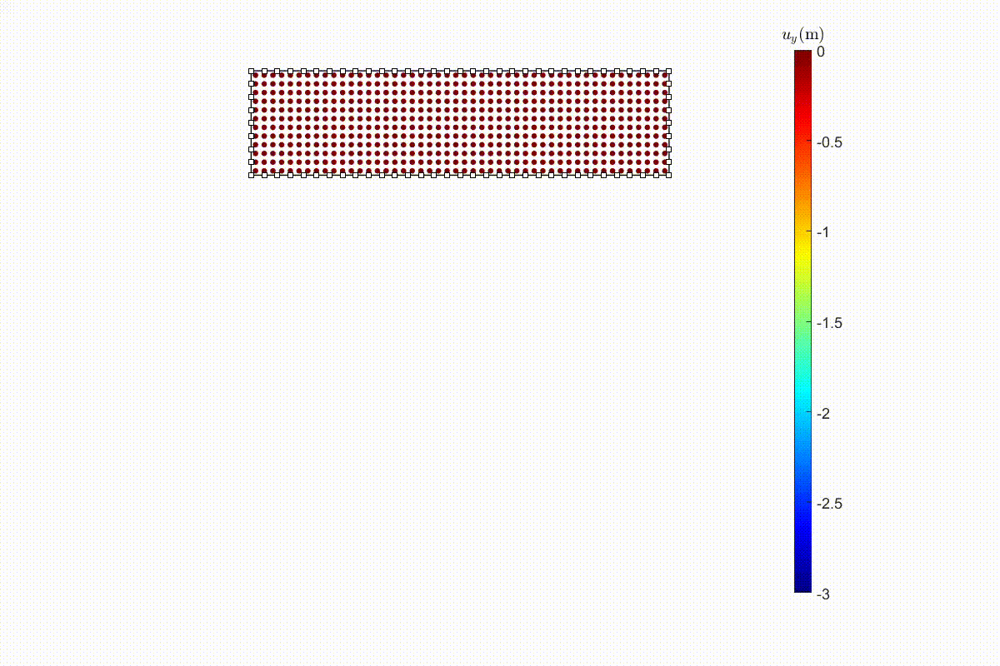

# MPM Mortar Contact

This repository presents some animations for the below manuscript:

***Liang, W., Fang, H., Yin, Z. Y., & Zhao, J. (2024). A mortar segment-to-segment frictional contact approach in material point method. Computer Methods in Applied Mechanics and Engineering, 431, 117294.***

DOI: https://doi.org/10.1016/j.cma.2024.117294 


#### 1. Elastic Cantilever Beam

<div align="center">
    
    <h4>Vertical displacement for the beam.</h4>
</div>

---

#### 2. Disk on Inclined Plane

<div align="center">
    
    <strong>Slip condition.</strong>
    
     <strong>Stick condition.</strong>
</div>

---
#### 3. Collision of Two Rings

<div align="center">
    
    <h4>Mean stress during the collision.</h4>
</div>

#### 4. Ironing Test

<div align="center">
    
    <h4>Vertical displacement during the loading.</h4>
</div>

---

#### 5. Compression of Deformable Grain Packing

<div align="center">
    
    <h4>Configuration of the deformable grains.</h4>
</div>

---

BibTex information
```
@article{liang2024mortar,
  title={A mortar segment-to-segment frictional contact approach in material point method},
  author={Liang, Weijian and Fang, Huangcheng and Yin, Zhen-Yu and Zhao, Jidong},
  journal={Computer Methods in Applied Mechanics and Engineering},
  volume={431},
  pages={117294},
  year={2024},
  publisher={Elsevier}
}
```